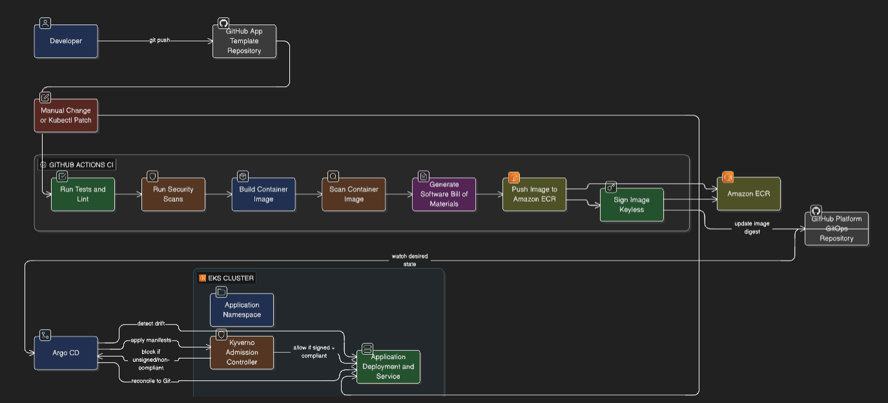

# Enterprise Secure CI/CD Platform — Infrastructure

This repository provisions the **core cloud infrastructure** for the **Enterprise Secure CI/CD Platform**.

It defines the foundational AWS resources required to operate a **secure, GitOps-driven Kubernetes delivery platform** using Terraform.

The infrastructure created here enables secure CI pipelines, GitOps deployments, supply-chain security enforcement, and policy-based runtime governance.

---

# Architecture Overview

This repository is part of a **multi-repository platform architecture**.

<p align="center">
  
</p>

</details>

---

# 🛡 Secure DevSecOps Pipeline

<details>
<summary><b>Click to view Architecture Flow</b></summary>

````mermaid
graph TD

A[Developer Commit] --> B[GitHub Actions CI]

subgraph CI Pipeline
B --> C[Build Container]
C --> D[Security Scans]
D --> E[Generate SBOM]
E --> F[Sign Image with Cosign]
end

F --> G[Amazon ECR Signed Images]
G --> H[GitOps Repository Desired State]
H --> I[Argo CD Continuous Delivery]
I --> J[EKS Cluster]
J --> K[Kyverno Admission Policies]
K --> L[Secure Workload Deployment]

style B fill:#f9f,stroke:#333,stroke-width:2px
style G fill:#ff9900,stroke:#333,stroke-width:2px
style I fill:#ef7b4d,stroke:#333,stroke-width:2px
style J fill:#326ce5,stroke:#333,stroke-width:2px
style L fill:#00ff00,stroke:#333,stroke-width:4px

</details>


Infrastructure provisioning for the above architecture is handled in this repository.

---

# Responsibilities

This repository manages the **platform infrastructure layer**, including:

### AWS Networking

- VPC
- subnets
- routing configuration

### Kubernetes Platform

- Amazon EKS cluster
- node groups
- cluster IAM roles

### Container Registry

- Amazon ECR repositories
- lifecycle policies

### Identity & Access

- IAM roles for Kubernetes services
- GitHub Actions **OIDC federation**
- least-privilege policies

### Encryption

- KMS keys for encryption
- secure resource configuration

### Platform Bootstrapping

- Argo CD installation
- Kyverno policy engine installation

---

# Separation of Responsibilities

To maintain clean boundaries, the platform is split into multiple repositories.

| Repository               | Responsibility                                |
| ------------------------ | --------------------------------------------- |
| **esdp-platform-infra**  | Cloud infrastructure and platform components  |
| **esdp-platform-gitops** | Kubernetes manifests and GitOps desired state |
| **app-template**         | Example application and CI pipelines          |

This separation ensures:

- infrastructure lifecycle independence
- GitOps-driven deployments
- strong separation between platform and application layers

---

# Infrastructure Components

The Terraform modules provision the following core components.

| Component | Purpose                              |
| --------- | ------------------------------------ |
| VPC       | Network foundation for the platform  |
| EKS       | Managed Kubernetes cluster           |
| ECR       | Container image registry             |
| IAM OIDC  | Secure GitHub Actions authentication |
| KMS       | Encryption for sensitive resources   |
| Argo CD   | GitOps continuous delivery           |
| Kyverno   | Kubernetes policy enforcement        |

---

# 📂 Repository Structure

<details>
<summary><b>View Project Structure</b></summary>
platform-infra/
├── modules/                # Reusable Terraform/IaC components
│   ├── vpc/                # Network stack
│   ├── eks/                # Kubernetes cluster
│   ├── ecr/                # Container registry
│   ├── github-oidc/        # Authentication for CI/CD
│   ├── argocd/             # GitOps CD controller
│   └── kyverno/            # Kubernetes policy engine
│
├── environments/           # Environment-specific infrastructure
│   ├── dev/
│   └── prod/
│
├── global/                 # Cross-environment resources
│   └── bootstrap/          # Terraform backend (S3 + DynamoDB)
│
├── scripts/                # Helper automation scripts
│
└── docs/                   # Architecture docs, ADRs and guides

</details>

### modules

Reusable Terraform modules implementing infrastructure components.

### environments

Environment compositions using the modules.

### global/bootstrap

Terraform backend bootstrap resources (remote state storage).

### scripts

Operational scripts used during platform setup.

### docs

Architecture documentation, ADRs, and operational guides.

---

# Security Design

The infrastructure is designed following **modern DevSecOps principles**.

### OIDC Authentication

GitHub Actions authenticate to AWS using **OIDC federation** instead of static credentials.

Benefits:

- eliminates long-lived secrets
- reduces credential leakage risk
- enforces short-lived access tokens

### Encryption

Sensitive resources are encrypted using **AWS KMS**.

### Least Privilege

IAM roles are scoped to the minimal permissions required.

### Policy Enforcement

Kyverno enforces runtime policies including:

- signed container images
- restricted container privileges
- resource limits enforcement

---

# Deployment Workflow

Infrastructure provisioning is executed using the Makefile.

### Initialize Terraform

```bash
make init ENV=dev
````

### Generate Execution Plan

```bash
make plan ENV=dev
```

### Apply Infrastructure

```bash
make apply ENV=dev
```

### Destroy Environment

```bash
make destroy ENV=dev
```

## Environments

Currently supported environments:

| Environment | Purpose                 |
| :---------- | :---------------------- |
| **dev**     | Development and testing |
| **prod**    | Production platform     |

Environment configuration is located under:

```bash
environments/<environment>
```

Terraform State Management
Terraform state is stored remotely to ensure safe collaboration.
Backend resources are created using the bootstrap configuration located in:

```bash
global/bootstrap
```

This includes:
S3 backend bucket
DynamoDB table (for state locking)

### Platform Bootstrap

Once infrastructure is provisioned, the cluster bootstrap installs:
• Argo CD — GitOps continuous delivery
• Kyverno — policy enforcement engine

These components enable secure GitOps-based application deployments managed by the platform-gitops repository.

### Operational Principles

This repository follows the following platform engineering practices:
• Modular Terraform architecture
• Immutable infrastructure
• GitOps deployment model
• Policy-driven security
• Least-privilege IAM design
• Automated CI/CD pipelines

### Related Repositories

| Repository          | Status                                 | Description                                   |
| :------------------ | :------------------------------------- | :-------------------------------------------- |
| **platform-gitops** |  | Kubernetes manifests and GitOps configuration |

# License

Copyright © 2026  
**thezxcvbnm.online**

This project is part of the **thezxcvbnm.online engineering portfolio** and demonstrates production-grade DevOps platform architecture, infrastructure automation, and secure CI/CD practices.

Permission is granted to view, study, and learn from the source code for educational and non-commercial purposes.

You may:

- review and study the implementation
- use the ideas and architecture for learning or inspiration
- reference this repository for educational purposes

You may **not**:

- redistribute this repository as your own work
- use the code or materials for commercial products or services without permission
- remove or alter the copyright notice

For collaboration or commercial licensing inquiries, please contact:

**contact@thezxcvbnm.online**

Website:  
https://thezxcvbnm.online
